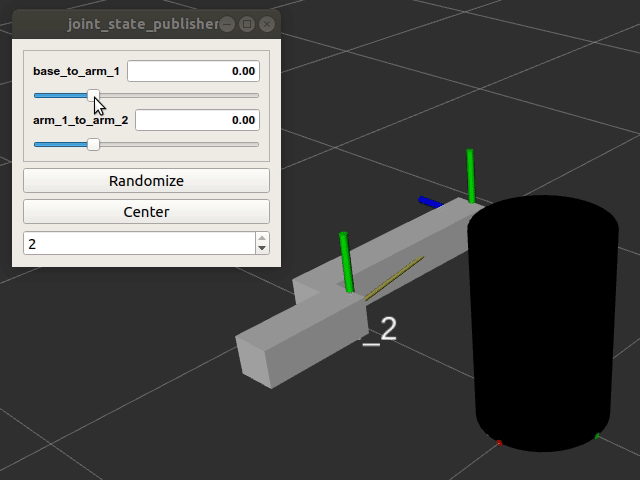

# reto_playtec
Proyecto de prueba de la empresa Playtec.

## Table of Content
Go to section
* [Installation](#1.-Installation)  
* [Usage](#2.-Usage)  
    * [Simple Communication](#2.1-Run-simple-publisher-&-subscriber)  
    * [Visualize URDF](#2.2-Visualize-URDF-robot)  
    * [Visualize PointCloud](#2.3-Visualize-PCD-(Point-Cloud-Data))  

## 1. Installation
Clonar el repositorio.
```
git clone https://github.com/ltruciosr/reto_playtec
```
Acceder al espacio de trabajo (ROS workspace), luego contruya el repositorio.
```
cd reto_playtec/reto_playtec_ws
catkin build
```
### 1.1 Optional
EL modulo de implementacion del gui se ha separado, instale el modulo gui:
```
sudo apt update
sudo apt install ros-<your_ros_version>-joint-state-publisher-gui
```
## 2. Usage
Antes de correr los archivos implementados, actualize el environment de ROS.
```
source devel/setup.bash
```
### 2.1 Run simple publisher & subscriber
Implementamos dos nodos de comunicacion, los cuales intercambian un mensaje de tipo "`std_msgs/String`".
```
roslaunch reto_ros reto_publisher.launch
roslaunch reto_ros reto_subscriber.launch
```
### 2.2 Visualize URDF robot
El modelo del robot se encuentra en el directorio __/urdf__ del paquete, el cual se define en el parametro: *robot_description*. \
Implementamos el nodo [**joint_state_publisher**](http://wiki.ros.org/joint_state_publisher), el cual actualiza el valor de las juntas del robot. Adicionalmente utilizamos la ventana [**joint_state_publisher_gui**](#1.1-Optional). \
Implementamos el nodo [**robot_state_publisher**](http://wiki.ros.org/robot_state_publisher), el cual actualiza el estado de los frames del robot. \
Finalmente, visualizamos el robot en rviz.
```
roslaunch reto_ros reto_urdf.launch
```

### 2.3 Visualize PCD (Point Cloud Data)
Visualizaremos un archivo **.pcd** en rviz, el archivo se descargo de un [database](https://sourceforge.net/projects/pointclouds/files/PCD%20datasets/). \
Procesamos el archivo "*office.pcd*", y lo transmitimos utilizando un mensaje de tipo "`sensor_msgs/PointCloud2`". \
Por defecto el frame de referencia del nodo "`plc_to_pointcloud`" es __/base_link__, para cambiar el frame de referencia, el cual es un parametro privado del nodo, construimos un archivo __.launch__, donde cambiamos el valor del parametro: *_frame_id*. Adicionalmente debemos de definir el rate de comunicacion del nodo. \
Finalmente, visualizamos el espectro de puntos en rviz.
```
roslaunch reto_ros reto_pcd.launch
```


